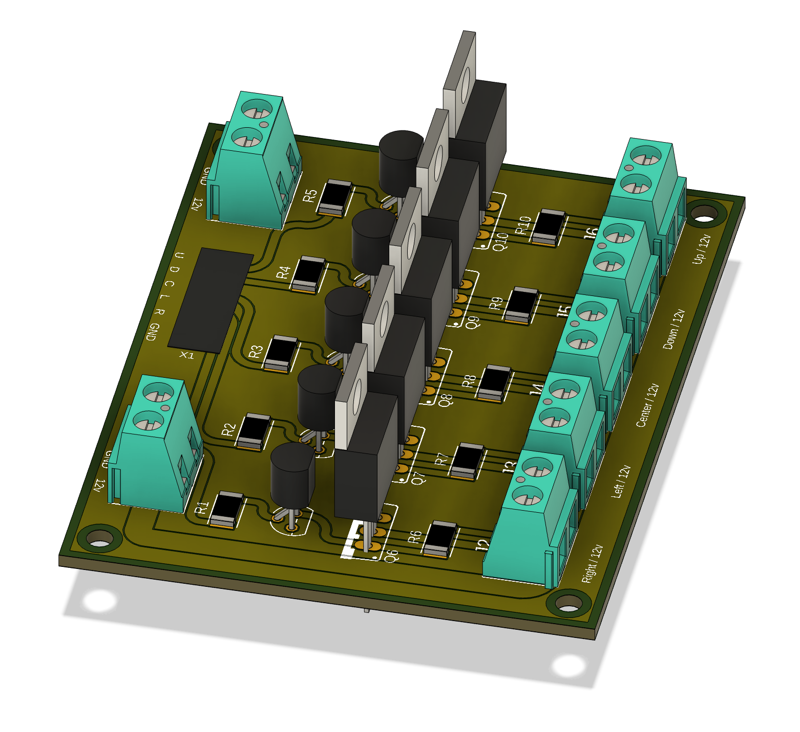
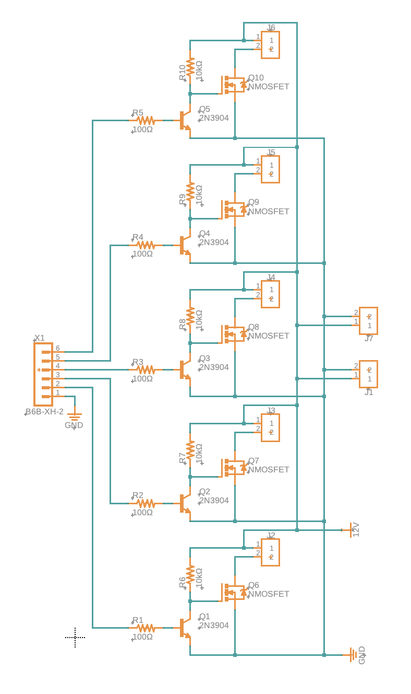
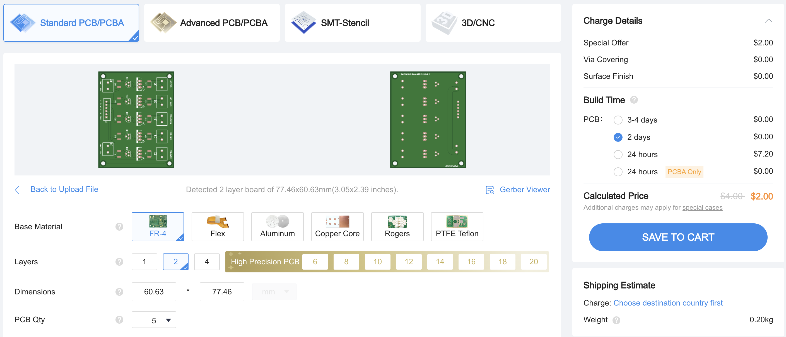

# Circuit and PCB
I have included the necessary files to have the PCB manufactured or perf-boarded for your use. 

## Schematic

The schematic is fairly simple. We take 5 arrow data lines, plus ground, into the 6 pin JST connector, and
a 12v power supply into one of the power screw terminals. The 12v are to power the LEDs as I was using 12v single 
colour LEDs for my implementation. 

The data lines coming out of the StepManiaX panel boards sit high (5v) and when the press threshold is reached
they are pulled down to ground (0v). Since my board needs to pull the LED ground pins to ground when the SMX
panel is also pulled to ground, I had to create a logic inverter since I'm using MOSFETs to drive the 12v LEDs from
the 5v SMX logic.  

The 5v logic is passed through a 100Ω resistor into the base of a BJT
([2n3904](https://www.onsemi.com/pdf/datasheet/2n3903-d.pdf)). The collector for the BJT goes into the MOSFET
([BUZ11](https://www.onsemi.com/pdf/datasheet/buz11-d.pdf)) gate and will pull it to ground when the BJT receives a
high 5v signal since the BJT Emitter is connected to ground. When the BJT is inactive (the SMX panel signal is pulled to
ground when the panel is pressed), the MOSFET gate is connected to a 10kΩ pullup to the 12v line thus activating the
MOSFET to connect the Drain (connected to the LED Arrow) to ground, completing the circuit. 

The second 12v screw terminal on the input side, is to daisy chain 12v to a second board for a second SMX pad if you 
are planning to make two. You should note that you will want to make sure your 12v power supply can handle both boards.
I guestimated the density of LEDs on my arrows would use about 1A for each arrow, and I think in general you'd be
hitting 6 arrows max and probably hardpressed to even do that, so 7A should be more than enough for 2 pads. 

## Bill of Materials (BoM)

Realistically, most of the items I used in my circuit can be interchanged with any other part that fits the criteria. 
This BoM will list exactly what I used and where you can find it, but if you have similar parts already, you can use
those instead. Specifically the MOSFETS, as I only used BUZ11 since I had a bunch lying around.

- R1, R2, R3, R4, R5: [100Ω 2010 SMD Resistor](https://www.digikey.ca/en/products/detail/yageo/RC2010FK-07100RL/5920949)
- R6, R7, R8, R9, R10: [10kΩ 2010 SMD Resistor](https://www.digikey.ca/en/products/detail/stackpole-electronics-inc/RMCF2010FT10K0/1758376)
- Q1, Q2, Q3, Q4, Q5: [NPN BJT Transistor 2N3904 TO92](https://www.digikey.ca/en/products/detail/onsemi/2N3904BU/1413)
- Q6, Q7, Q8, Q9, Q10: [BUZ11 N-CH MOSFET](https://www.digikey.ca/en/products/detail/onsemi/BUZ11-NR4941/1954150)
- J1, J2, J3, J4, J5, J6, J7: [2P Terminal Block Side ENT 5.08mm PCB](https://www.digikey.ca/en/products/detail/phoenix-contact/5442206/4390264) 
- X1: [B6B-XH-A](https://www.digikey.ca/en/products/detail/jst-sales-america-inc/B6B-XH-A/1000381)

### Notes
- I personally accidentally bought 1206 sized resistors for my board, but the correct size is 2010.
  - If you are doing this on a perf-board or something you can use through-hole resistors if you want.
- The BUZ11 MOSFETs look unavailable at the digikey link I added up there, so you'll have to find some alternative. 
  - I'm certainly no expert, but I think you could use: [FQP30N06L](https://cdn.sparkfun.com/datasheets/Components/General/FQP30N06L.pdf),
[IRFZ44N](https://www.infineon.com/dgdl/Infineon-IRFZ44N-DataSheet-v01_01-EN.pdf?fileId=5546d462533600a40153563b3a9f220d),
[IRF640](https://www.vishay.com/docs/91036/sihf640.pdf), or some other N-Channel Power MOSFET.
- For the `B6B-XH-A` JST connector, remember that you will need [XHP-6](https://www.digikey.ca/en/products/detail/jst-sales-america-inc/XHP-6/1651016)
and [SXH-001T-P0.6N](https://www.digikey.ca/en/products/detail/jst-sales-america-inc/SXH-001T-P0-6N/7041446) to connect
wires to this terminal. This will be covered more in the `wiring` section of this guide. 

## Manufacturing the PCB

I personally have been using [JLCPCB](https://jlcpcb.com/) to manufacture my hobby boards as they are very cheap,
decent quality, and fairly quick to ship. I have included the
[SMX LEDs JLCPCB Gerber](Files%2FSMX%20LEDs%20JLCPCB%20Gerber.zip) archive in this repo, so you can just plug that into
JLCPCB and have it manufactured. I typically just keep all defaults, else you start incurring extra charges. I may have
a few boards left, so if you reach out I may be able to send you one or two for a good price.

The only JLCPCB option you may want to set is the `RemoveOrderNumber` option. Set it to `Speceify a location` as the
board follows the instructions to place their order number in a specific location instead of it randomly appearing 
somewhere on the board. 

## Soldering

This guide assumes that if you are getting this PCB manufactured that you have the knowledge to solder it all together.
Typically you want to solder parts from shortest to tallest, so start with the resistors, then the BCJ transistors and
6 pin JST connector, the screw terminals, and finally the MOSFETs.

## Enclosure
I had plans to model and 3D print an enclosure for the board as well, but I haven't gotten around to it. I will
update this guide and add it in once I do.

# License
The circuit and hardware files found in this folder are licensed under
[CERN OHL v2 Permissive](https://choosealicense.com/licenses/cern-ohl-p-2.0/).
