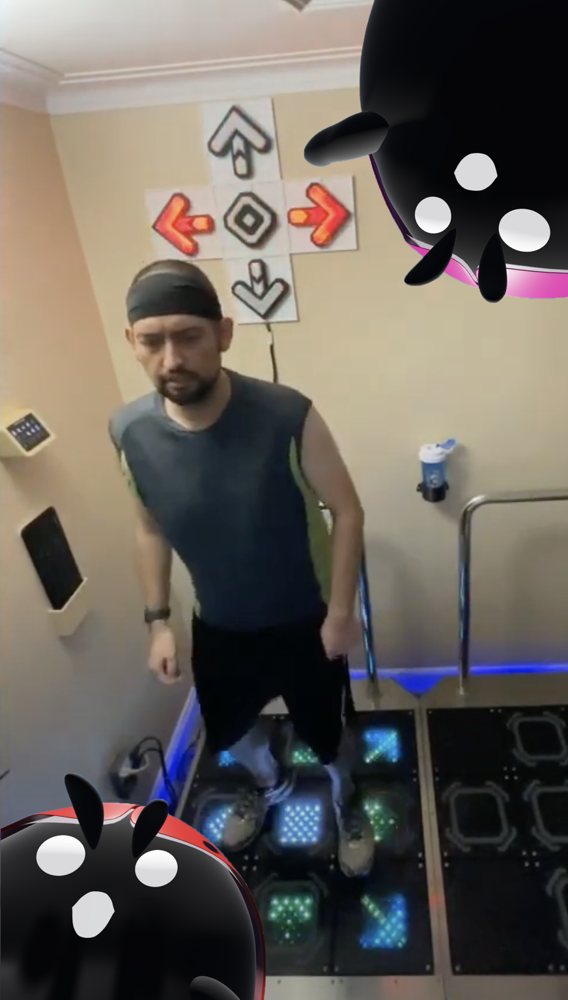

# StepManiaX LED Mirroring Project
The goal of this project is to create 5 3D printed arrows with LEDs in them connected
to your StepManiaX (SMX) stage to mirror the steps that you are stepping.

This project requires:
- 3D Printing
- Soldering
- Wire Crimping
- Super Gluing
- Hot Gluing
- Various other small but not insignificant tasks.

Throughout this guide I will be linking all the products I used to create the finished product
but you are by no means required to use exactly the same items I did. This project can be
completed in a number of ways and this is just one.

I will apologize in advance as I have not taken a lot of pictures of this process, but I will
do my best to relay everything I can in Text.

You can see a video of the finished product (The LED Arrows Behind Me) Here:

# Steps

1. [3D print models and combine](./3D%20Prints/README.md)
2. [Oder and populate the PCB](./Circuit/README.md)
3. [Wire necessary cables](./Wiring/README.md)
4. [Putting it all together](./Finishing/README.md)

# Problems? Comments? 
If you had **ANY** problems with this guide, have improvement ideas on the project, or if you think certain sections 
could be expanded or refined, please don't hesitate to let me know.
I encourage you to open up an [Issue](https://github.com/fchorney/StepManiaX-LED-Arrows/issues),
or even a [Pull Request](https://github.com/fchorney/StepManiaX-LED-Arrows/pulls) if you know what you want changed.

I will be sure to check them out, and continue to make this guide better. 

# Future Updates
I already have a big list of upgrades that I want to make to this project for version 2. I can't promise it will happen
any time soon, but hopefully sometime this year. 

Here is a sneak peek of the ideas I want to work on for version 2:
- Snap Connectors for all 3D parts.
  - Trying to avoid as much glue as possible
- Cable channel on backplate could be deeper and wider
  - I personally had some issues fitting 10 x 18AWG stranded wires in the channels
- Backplate connectors need to be better
  - The small connectors really don't do much aside from align the plates. Need a better solution to connect them together
- Design for those JST-SH connectors to snap into the arrow base itself
  - The SH-series connectors are made to fit into holes, maybe leverage this for a better fit and less glue
- Use 20AWG instead of 18AWG in the future probably
  - 18 seems a little big, probably don't need it to be so thick
- Support all 9 panels
- RGB Addressable LEDs
  - Everything can run off of 5v this way, and we have way more options for customizations
- Pico-W Brains
  - This may cause **some** latency since it won't be a purely analog circuit anymore, but this would give crazy customization
  - Different modes, change colors for every step, pulse on freeze, rainbow, etc
- Stream Integration
  - If we use a Pico-W, since it had wifi there is a possibility you could write some code to connect it to twitch chat
and let chat spend points/bits/etc to control the arrows
- Maybe just use screw terminals for all circuit board inputs to be consistent
  - Having to use a handful of different connector types is kind of annoying
- Small PCB LEDs for inputs
  - Might be nice to show what the inputs are with small leds on the pcb
- Can we intercept the SMX data going to the panels to display the judgement color?
  - Theoretically when you hit a panel, it tells the game you hit it and the game judges you and sends back the judgement.
  - We can maybe man in the middle this to figure it out, and actually light our arrows the color the game tells us to.

# Special Thanks
Big thanks to the [Step Revolution](https://www.steprevolution.com/) crew for making a super fun game, being cool with me
making this kind of stuff, and even helping me out with some aspects of it.

Thanks to [Daaanty](https://www.twitch.tv/daaanty) for giving me some great ideas for the arrow models as well as helping
me track down some of the harder to find connectors. 

Thanks to Cube for making this helpful [SMX Pad to Andamiro Cabinet](https://docs.google.com/document/d/1XnCEbnF3oVle8vsj_GakjsSuEs43jKPMqEG-YfRb-IE/edit#heading=h.98pnc1v5ryli)
guide which helped me confirm some wiring.

Make sure to check out the [Official StepManiaX Discord](https://discord.gg/stepmaniax-430779485026254848) where you
can find a lot of us chatting about SMX and talking about fun projects like this!

# ⚠️ WARNING ⚠️
Making this project and messing with your StepManiaX stages are entirely at your own discretion. 
StepRevolution and I provide absolutely **NO** warranty if something happens to go wrong.

# License
All materials in this project are licensed as [CC BY-NC-SA 4.0](https://creativecommons.org/licenses/by-nc-sa/4.0/) unless otherwise specified.
