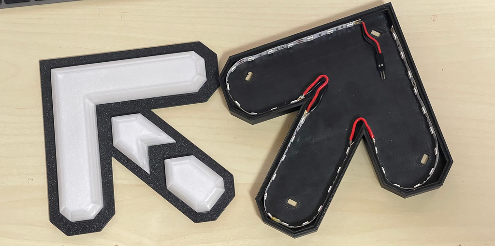

# Wiring
This section explains how I wired everything together, what wires and connectors I used, where to get them, and what
tools you will need. 

This section assumes you have the arrows all printed, and the circuit board finished. We will cover adding LEDs and
wires to the arrows, making a splitter for the SMX Data lines, and connecting it all together.

# Bill of Materials (BoM)

## Wiring
- [18/20/22 AWG Stranded Hookup Wire (Black, Red)](https://www.aliexpress.us/item/1005002288468147.html)
- [JST-SM Male/Female 2P Connectors](https://www.aliexpress.us/item/1005005780885587.html)
- [22 AWG 6 Core Cable](https://www.aliexpress.us/item/4000570401041.html)
- [22 AWG 9 Core Cable](https://www.aliexpress.us/item/4000570401041.html)
- [12v DC 60LEDs/M LED Strip](https://www.aliexpress.us/item/1005002934660865.html)

# Connectors
- [YLR-09V JST YL-Series Receptacle](https://www.digikey.ca/en/products/detail/jst-sales-america-inc/YLR-09V/9921747)
- [YLP-09V JST YL-Series Plug](https://www.arrow.com/en/products/ylp-09v/jst-manufacturing)
- [SYF-01T-P0.5A 20-26 AWG Crimp Socket](https://www.arrow.com/en/products/syf-01t-p0.5a/jst-manufacturing?q=SYF-01T-P0.5A)
- [SYM-01T-P0.5A 20-26 AWG Crimp Pin](https://canada.newark.com/jst-japan-solderless-terminals/sym-01t-p0-5a/contact-pin-26-20awg-crimp/dp/57AC7552?st=SYM-01T-P0.5A)
- [WM1781 10 Pin Molex Plug](https://www.digikey.ca/en/products/detail/molex/0430201000/252494)
- [WM1787 10 Pin Molex Receptacle](https://www.digikey.ca/en/products/detail/molex/0430251000/252500)
- [WM1841CT Molex 20-24 AWG Crimp Pin](https://www.digikey.ca/en/products/detail/molex/0430310001/467798)
- [WM1837CT Molex 20-24 AWS Crimp Socket](https://www.digikey.ca/en/products/detail/molex/0430300001/467796)
- [XHP-6 JST XH-Series 6 Pin Receptacle](https://www.digikey.ca/en/products/detail/jst-sales-america-inc/XHP-6/1651016)
- [SXH-001T-P0.6N JST XH-Series Crimp Socket](https://www.digikey.ca/en/products/detail/jst-sales-america-inc/SXH-001T-P0-6N/7041446)

# Tools & Other
- [12v 7A DC Power Supply](https://www.aliexpress.us/item/1005006333977811.html) 
- [SN-28B Pin Socket Terminal Crimper](https://www.amazon.ca/Terminal-Crimping-Ratchet-Crimper-Connector/dp/B075NY2YM6/ref=sr_1_12)
- [Insulated Wire Terminal Crimper](https://www.amazon.ca/gp/product/B01IQIALJC/ref=ppx_yo_dt_b_search_asin_title)
- [Fork/Spade Terminal Kit](https://www.amazon.ca/Twidec-Insulated-Connectors-Assortment-N-021-250PCS/dp/B0BB25LSF2/ref=sr_1_4)
- [HSC8 6-4 Ferrule Crimper](https://www.amazon.ca/gp/product/B08CXT9Y8L/ref=ppx_yo_dt_b_search_asin_title)
- [Ferrule Terminal Kit](https://www.amazon.ca/Lytool-Insulated-Connectors-Terminals-Single-Line/dp/B0BY2CS16J/ref=sr_1_8)
- [Heat Shrink Tubing](https://www.amazon.ca/Wirefy-180-Heat-Shrink-Tubing/dp/B084GDLSCK/ref=sr_1_5)
- [0.5 Inch Braided Cable Sleeves](https://www.amazon.ca/Pack-33ft-Protector-Expandable-Sleeving/dp/B07ZT9PL72/ref=sr_1_12)
- Small Pliers
- Cable Snips
- Soldering Station
  - SN63/PB37 Solder
  - Solder Flux
- Super Glue

## Notes

- You should be able to buy most of this stuff on Amazon, or AliExpress (which I have linked above), or possibly
other websites as well.
- You will need to determine the length of your wiring needs.
- For the LED strips, I found that the arrows used 12 sections of 3 LEDs each, and the center panel used 13 sections
of 3 LEDs each.
- For the 12v power supply, you won't need 7A for just one pad. It's up to you to figure out how many amps you'll need
based on how many LEDs you are powering. 
- For the hookup wire, I opted to use a thicker AWG for going from the circuit board to the LEDs as the distance
travelled is fairly long and I figured a thicker cable would be better in that case. From what I've read, 22 AWG
should realistically be more than enough to carry about 1A of power to each arrow.
- If you can't source 6 and/or 9 core cable, you can just use loose hookup cable.

### JST YL-Series
I have personally found that the YL-Series connectors/pins/etc have been extremely hard to come by. This connector is
what the SMX pads use internally for the data connections that we want to connect to, which is why I spent too much 
money on shipping just to get the correct parts. One possible alternative would be to use 
[T-Taps](https://www.amazon.ca/Ginsco-Connectors-Terminals-Electrical-Self-Stripping/dp/B09YGH6FNQ/ref=sr_1_4), but this
is generally thought to be a weaker solution, but will work in a pinch.

## Connecting the LEDs to the Arrows
Thankfully I actually have a video for this part. Though a few things in the video are incorrect compared to this guide.
Initially I was using dupont connectors for the LED connections, but have since switched to JST-SM connectors instead.

The video covers super gluing the arrow pieces together, soldering wires to the LEDs, gluing the LEDs into the arrow
bodys, and connecting them all up. You can watch the video here: https://www.youtube.com/watch?v=dij5LlBn8TU

The tl;dr for this would be:
- Super glue the `top` arrow pieces to the `insert` arrow pieces for all arrows and center.
- Prep your LED strips by cutting them to size, applying solder to the contacts, and wiring them up
- Super glue the LED strips into the arrow bodies as shown in the video
- Solder the JST-SM connectors to the LED strips (the video shows Dupont)

At this point you are done with the arrows **for now**. 

## Creating the SMX Pad Harness
This harness is essentially what we will be looking to make. This will intercept the pad signal data and split it out
so that it continues to be connected to the pads controller, as well as our circuit board. I have opted to make a 3 way
split, but in general I would suggest just making it a 2 way as it will be less complicated. 

To achieve this, you will need the following items:
- 1 x YLR-09V Receptacle
- 1 x YLP-09V Plug
- 9 x SYF-01T-P0.5A Crimp Socket
- 9 x SYM-01T-P0.5A Crimp Pin
- 2 x WM1787 Receptacle (or just 1 if making a dual split)
- 20 x WM1837CT Socket (or just 10 if making a dual split)
- 3 x 15cm Piece of 9 Core Cable (or just 2 if making a dual split)
- 1 x 22AWG Fork Terminal
- 2 x 20cm Piece of 22AWG Stranded Cable (or just 1 if making a dual split)

To start off, we can check the current connections, and make a note of where the cables should go in the connectors.

The connector connected to the panels themselves seems to be a YLR-09V Receptacle, and the connector going to the
stage controller is a YLP-09V Plug. Thus we want to connect our triple splitter to our YLP-09V Plug so that we split the
signal coming out of the panel connectors. 

We can also infer the position of the connectors from these pictures, as well as this one which details which color is
connected to which panel. 

Now, at this point we have a small issue that we will need to document so we can be sure we are connecting the right
connections together. The 9 core cable I have **almost** exactly matches the colors in the pad, but not quite. You'll
want to write down what colors from the panels match up with whatever wires you are using. For me, all the colors except
grey matched up, and in my case grey from the panel would match up with purple from my cable. 

As I was making a triple splitter as well I opted to actually solder my wires to the crimp connectors, and add heat
shrink as well. This part can be fairly difficult as these connectors arent typically meant to connect multiple wires
to a single connector. Your mileage may vary. 

For each cable that I needed to connect I did the following:
- Remove about 1-1.5 inches of insulation from the end of each cable
- Grab all of the same colors wires that you need and remove a small bit of insulation to expose the wires (about 4mm)
- Twist the 3 wires together and solder them together
- Add some heat shrink to the wire behind the soldered end and heat it to hold the 3 wires together
- Put an extra bit of heat shrink on the wire before crimping for use later
- Snip off any extra wire and connect it to the SYM-01T-P0.5A using a set of pliers to hold it all in place
- Use the SN-28B crimper to properly crimp the connector
- Apply a bit of solder to the crimp pin and wires where they connect. This is optional as these conectors are meant to
be solder-less.
- Move the heat shrink piece we previously left on the wires up to the crimped and soldered connector and heat to protect
the crimp.

After doing this for the 9 wires I added a bit more heatshink over each 9 core end for a bit of straing relief and to
compress them a bit.

If you want, you can electrically test your connections with a multimeter to make sure the pins are properly connected
to each end. 

From here we have 3 more connectors to connect, but these should be much easier as we are doing single cables.

First you can connect one of the 9 core conductors to the YLP-09V Receptacle using pliars and/or a crimping tool.
Take note that the left to right order of the colors will be reversed.
For example here is the mapping for my cable colors.

SMX 9 Cable to 9 Conductor Wire (Almost 1:1, SMX Grey is Wire Purple)

1 (Up-Left) - SMX Red    -> Wire Red  
2 (Up) - SMX Orange -> Wire Orange  
3 (Up-Right) - SMX Yellow -> Wire Yellow  
4 (Left) - SMX Green  -> Wire Green  
5 (Center) - SMX Blue   -> Wire Blue  
6 (Right) - SMX Brown  -> Wire Brown  
7 (Down-Left) - SMX Grey   -> Wire Purple  
8 (Down) - SMX White  -> Wire White  
9 (Down-Right) - SMX Black  -> Wire Black  

SMX Wire Colors to JST Connector (Hook on bottom, Male, looking at wire input side. This may look upside down as the
connector hook is on the bottom of the connector)

7 : 8 : 9  
4 : 5 : 6  
1 : 2 : 3  

9 Conductor Wire to JCT Connector (Hook on bottom, Female, looking at wire input side)

9 : 8 : 7  
6 : 5 : 4  
3 : 2 : 1  

This can be a bit confusing, but you just need to make sure that the same color is going to the same color regardless
of the YL-Series connector you are making.

After this you can connect your 2 (or 1) 10-pin molex connectors. I opted for a 10-pin molex as we need to grab the
ground pin as well. As you can see in the finished image, I opted to combine the 2 x 22AWG ground cables together into
a fork terminal (you'll see why I used this later) that connect to the 2 10-pin molex connectors. I just used some heat
shrink to hold these together with the other cables.

Similarly to the YLP-09V, you will want to make a mapping for the 9 core cable to the molex pins. Here is mine:

9 Conductor Wire to Molex 10 Pin (Hook on top, Female, looking at wire input side)

5 : 4 : 3 : 2 : 1  
G : 9 : 8 : 7 : 6

(G is Ground)

As you can see in the photo's, I didn't do both, I just wrapped one of the branches off with some electrical tape.

You should have a similarly finished cable harness:

Once again, you might want to test the electrical connections with a multimeter to make sure it's all correct.

Now it's time to install. The area you want to get into is the middle section of the front of the stage. You will need to remove the 6 screws with
the smaller allen wrench that you received with your stage(s).

You can install this into your SMX pad by unplugging the original YL-Series connectors for the stage wires (shown in 
the picture with red arrows. I have already split them here), and placing
your harness inbetween them. One last thing you'll want to do, is connect the harness ground we made to the 5v 
ground terminal from the 12v -> 5v converter (shown in blue).

Turn your game back on and make sure your pad still works correctly with the game. If done properly, you should notice
no changes. 

## Creating the 6 core Pad to PCB Cable

The next cable we are going to need is the Molex 10-pin to JST XH-Series 6 pin to connect to the circuit board. 
Apologies as I don't have any pictures of this. 

Once again, the 6 core wire has different wire colors that don't necessarily match up with the SMX panel wire colors.
Here is my mapping for what I had:

6-Core Black = Ground  
6-Core Orange = 2 (Up) - Molex Orange  
6-Core Green  = 4 (Left) - Molex Green  
6-Core Yellow = 5 (Center) - Molex Blue  
6-Core Red    = 6 (Right) - Molex Brown  
6-Core White  = 8 (Down) - Molex White  

Molex 10 Pin to 6 Conductor Wire (Hook on top, Male, looking at wire input side)

X : 2 : X : 4 : 5  
6 : X : 8 : X : G

Once again just a reminder to double check your connections that they are mapping to the correct signals that you care
about. This can be tricky when you are dealing with different coloured wires, so make your own mapping and double
check everything. 

As some of the above instructions, you just want to crimp the molex wires, and crimp the JST XH-series pins on the other
side using a crimper or pliers. I don't think the tools I have are meant to crimp the very tiny XH-series sockets, so I 
tend to just do it with some pliers manually. 

## Cable Routing Through Pad

At this point you'll want to route this new cable through your SMX pad. You will need to remove the top panels as well
as the panel mounts under there. As you can see in this image, you will need to unscrew the 8 screws (shown in red),
and un-connect all cables shown in blue (the signal cable needs to be unscrewed from the screw terminal to come out). 
For the panels that have sensors, you might need to remove the rubber corners to get to the 8 screws. You should 
**NOT** need to unplug the FSR sensors to remove the panel mounts. 

Remove the 3 left panels and panel mounts, connect the molex side to the splitter/harness you made and installed
earlier, and route it through the pads as shown here:

As shown in the above image, there are various walls, holes, etc in the stage so you'll need to route the cable around
or through them. If you want you can probably route this on the right or left side as I believe it is symmetric.
From the front box, you'll go left and you'll find some gaps near the bottom of the walls, so slide the cable under 
the walls to get into the top left panel box. 

You will want to try and feed your cable through the hole shown above and into the hole the arrow is pointing to. The
side of the pads have a cable channel that you want to run your cable through all the way to the bottom left panel.
Once you reach the bottom left panel, pull your cable out of the channel and route it out of one of the 4 holes
on the bottom of the pad. Make sure you pull as much slack as you need, and you should be able to put all the panels
back on in reverse order of how you took them off in the first place. 

Congratulations, your wiring should be done..... for now, there's actually more in the `Finishing` section.
